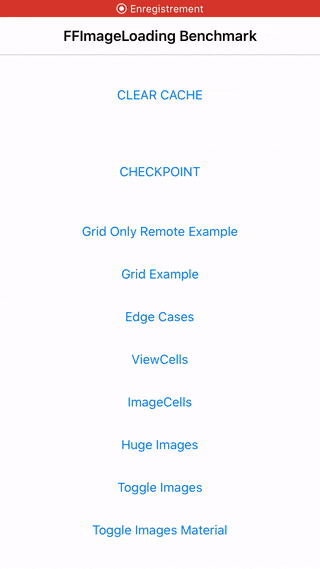
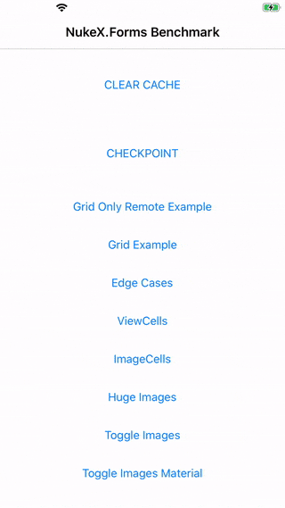
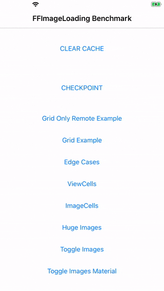
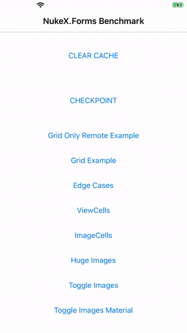

# Xamarin.Forms.Nuke

<p align="left">

[Nuke](https://github.com/kean/Nuke/) image caching library for Xamarin.Forms.

Get it from NuGet:

[](https://www.nuget.org/packages/xamarin.forms.nuke)

This repository was inspired by Jonathan Peppers ```GlideX``` implementation of the new ```IImageViewHandler``` interface for ```Xamarin.Forms``` (https://github.com/jonathanpeppers/glidex).

Its goal is to provide the same kind of implementation for ```iOS```, achieving a complete image caching solution for ```Xamarin.Forms```: you don't have to change any line of your existing project, the ```Xamarin.Forms``` image source handlers will just be overridden with cache-enabled ones.

## Installation

### Xamarin.Forms.Nuke


1. Install https://www.nuget.org/packages/xamarin.forms.nuke/ in your xamarin forms **iOS** project
2. Add this Init method after ```Forms.Init``` call:

```csharp
Xamarin.Forms.Forms.Init();
Xamarin.Forms.Nuke.FormsHandler.Init(debug: false);
LoadApplication(new App());
```

### GlideX.Forms

1. Install https://www.nuget.org/packages/glidex.forms/ in your xamarin forms **Android** project
2. Add this one liner after your app's ```Forms.Init``` call:

```csharp
Xamarin.Forms.Forms.Init (this, bundle);
//This forces the custom renderers to be used
Android.Glide.Forms.Init (this);
LoadApplication (new App ());
```

### BOOM

You just achieved **90%+** memory reduction when manipulating ```Image``` views on **both** platforms.


## Benchmark

I changed a bit the ```glidex``` benchmark samples to have a more fair comparison. I switched from a random distribution of the images to a deterministic one to be sure we are comparing the same data set.

I used ```System.Diagnostics.Process.GetCurrentProcess().WorkingSet64``` to have the memory workload of the process. The value given in the results are the **consumed bytes** between the ```MainPage``` and the complete loading of the target page.

The tests have been made on an iPhone 7 (real device, not a simulator).

For each test:

1. Launch iPhone 7
2. Wait 4-5 seconds on ```MainPage```
3. Launch a Page
4. Scroll till the end of page
5. Get consumed bytes in the output window
6. Empty caches
7. Kill app


<table>
	<thead>
		<tr>
      		<th>Page</th>
      		<th>Data Type</th>
			<th>Xamarin.Forms 4.5.0.356</th>
      		<th>Xamarin.Forms.Nuke 8.4.0</th>
		</tr>
	</thead>
	<tbody>
		<tr>
			<td>GridOnlyRemotePage</td>
			<td>Remote only</td>
			<td align="right">248 905 728</td>
			<td align="right">15 073 280 <b><font color="greev">(-94%)</font></b></td>
		</tr>
		<tr>
			<td>GridPage</td>
			<td>Remote and local mix</td>
			<td align="right">195 035 136</td>
			<td align="right">15 040 512 <b><font color="greev">(-92%)</font></b></td>
		</tr>
		<tr>
			<td>ViewCellPage</td>
			<td>Remote and local mix</td>
			<td align="right">41 418 752</td>
			<td align="right">20 758 528 <b><font color="greev">(-50%)</font></b></td>
		</tr>
		<tr>
			<td>ImageCellPage</td>
			<td>Remote and local mix</td>
			<td align="right">27 000 832</td>
			<td align="right">20 611 072 <b><font color="greev">(-24%)</font></b></td>
		</tr>
		<tr>
			<td>HugeImagePage</td>
			<td>Local only</td>
			<td align="right">128 516 096</td>
			<td align="right">8 634 368 <b><font color="greev">(-93%)</font></b></td>
		</tr>
	</tbody>
</table>

### Comparison with FFImageLoading

Before I could successfully bind the `Nuke` swift library, I tried to use `FFImageLoading` as image source handler. You can find the older repository here: 

https://github.com/roubachof/Xamarin.Forms.ImageSourceHandlers

As expected the native `Nuke` library outperforms `FFImageLoading` on every test.

<table>
	<thead>
		<tr>
      		<th>Page</th>
      		<th>Data Type</th>
			<th>FFImageLoading 2.4.11.982</th>
      		<th>Xamarin.Forms.Nuke 8.4.0</th>
		</tr>
	</thead>
	<tbody>
		<tr>
			<td>GridOnlyRemotePage</td>
			<td>Remote only</td>
			<td align="right">25 722 880</td>
			<td align="right">15 073 280 <b><font color="greev">(-41%)</font></b></td>
		</tr>
		<tr>
			<td>GridPage</td>
			<td>Remote and local mix</td>
			<td align="right">24 674 304</td>
			<td align="right">15 040 512 <b><font color="greev">(-39%)</font></b></td>
		</tr>
		<tr>
			<td>ViewCellPage</td>
			<td>Remote and local mix</td>
			<td align="right">28 852 224 <i>(1)</i></td>
			<td align="right">20 758 528 <b><font color="greev">(-28%)</font></b></td>
		</tr>
		<tr>
			<td>ImageCellPage</td>
			<td>Remote and local mix</td>
			<td align="right">28 868 608 <i>(2)</i></td>
			<td align="right">20 611 072 <b><font color="greev">(-28%)</font></b></td>
		</tr>
		<tr>
			<td>HugeImagePage</td>
			<td>Local only</td>
			<td align="right">10 059 776</td>
			<td align="right">8 634 368 <b><font color="greev">(-14%)</font></b></td>
		</tr>
	</tbody>
</table>

* *(1)* often fails to load first images (failed 7 times on 10)
* *(2)* often fails to load some images (failed 6 times on 10)


And more importantly, it loads way faster the cells images:

#### View Cells test

<table>
	<thead>
		<tr>
			<th>FFImageLoading</th>
			<th>Nuke</th>
		</tr>
	</thead>
	<tbody>
		<tr>
			<td></td>
			<td></td>
		</tr>
  </tbody>
</table>

#### Image Cells test

<table>
	<thead>
		<tr>
			<th>FFImageLoading</th>
			<th>Nuke</th>
		</tr>
	</thead>
	<tbody>
		<tr>
			<td></td>
			<td></td>
		</tr>
  </tbody>
</table>
